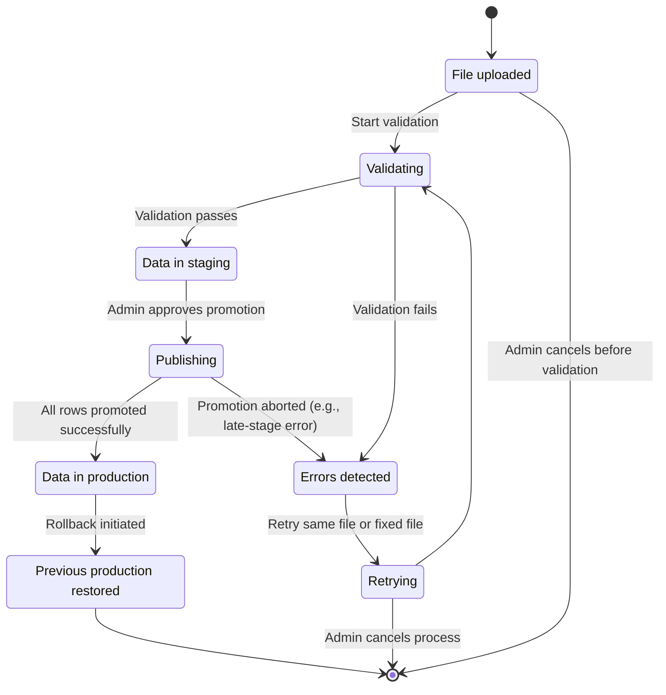

# CSV Import State Transition Diagram

This diagram shows the complete state flow for CSV file uploads in the Results America system.

## State Descriptions

### **Uploaded**
- File has been uploaded to the system
- File hash calculated for duplicate detection
- Basic file validation (size, format) completed
- Import record created in `csv_imports` table

### **Validating**
- CSV parsing and schema validation in progress
- Business rule validation (state names, year ranges, etc.)
- Reference integrity validation (foreign keys)
- Data quality checks and error collection

### **Staged**
- Validation completed successfully
- Data stored in `csv_import_staging` table
- Ready for admin review and approval
- Can be viewed, edited, or published

### **Failed**
- Validation errors detected
- Error details logged in `import_logs` table
- Import can be retried with corrected file
- Admin can view specific error details

### **Retrying**
- Admin has chosen to retry with same or corrected file
- Previous staging data cleared
- New validation cycle begins

### **Publishing**
- Admin has approved the staged data
- Data being moved from staging to production tables
- Final integrity checks performed
- Import session created for data lineage

### **Published**
- Data successfully moved to production
- Available to end users
- Import session linked to data points
- Audit trail complete

### **RolledBack**
- Emergency rollback of published data
- Previous production state restored
- Import session marked as inactive
- Rollback reason logged

## Transition Conditions

### **Start Validation**
- Triggered automatically after file upload
- Begins comprehensive validation process
- No user intervention required

### **Validation Passes**
- All validation rules satisfied
- No critical errors detected
- Data ready for staging

### **Validation Fails**
- One or more validation errors found
- Errors categorized and logged
- Admin can review specific issues

### **Retry Process**
- Admin uploads corrected file
- Or admin chooses to retry with same file
- Previous staging data cleared

### **Admin Approval**
- Admin reviews staged data
- Confirms data quality and accuracy
- Initiates promotion to production

### **Promotion Success**
- All data points successfully inserted
- Import session created and linked
- Status updated to published

### **Promotion Failure**
- Late-stage database error
- Constraint violation
- System error during final insert

### **Rollback Initiated**
- Emergency situation requiring data removal
- Admin or system initiates rollback
- Previous state restored

### **Process Cancellation**
- Admin cancels import process
- Staging data cleaned up
- Import record marked as cancelled

## Implementation Notes

### **Database Status Values**
The system uses these status values in the `csv_imports` table:
- `uploaded`: Initial upload state
- `validating`: Validation in progress
- `staged`: Validation passed, data staged
- `validation_failed`: Validation errors found
- `importing`: Publishing to production
- `imported`: Successfully published
- `failed`: Final failure state
- `cancelled`: Process cancelled by admin

### **Error Handling**
- All state transitions are logged
- Error details stored in `import_logs`
- Validation summaries in `import_validation_summary`
- Rollback operations tracked in audit trail

### **User Interface**
- Admin interface shows current state
- Action buttons enabled/disabled based on state
- Progress indicators for long-running operations
- Error details displayed for failed states 