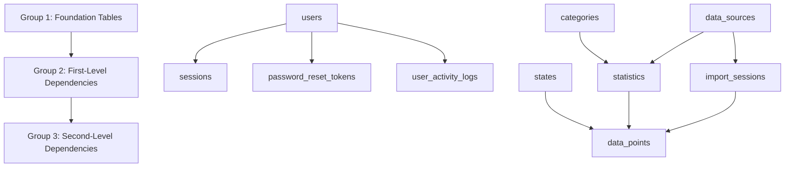

# Database Dependency Report
## Proper Table Population Order Based on Foreign Key Relationships

This report analyzes the database schema to determine the correct order for populating tables to avoid foreign key constraint violations.

---

## 📊 **DEPENDENCY GROUPS**

### **GROUP 1: Foundation Tables (No Foreign Keys)**
*These tables have no dependencies and can be populated first*

| Table | Description | Key Fields |
|-------|-------------|------------|
| `users` | User authentication and management | `id` (PK), `email`, `name`, `role` |
| `states` | US states and territories | `id` (PK), `name`, `abbreviation` |
| `categories` | Data categories (Education, Economy, etc.) | `id` (PK), `name`, `description` |
| `data_sources` | External data providers (BEA, BLS, Census) | `id` (PK), `name`, `description`, `url` |

**Population Priority:** ⭐ **HIGHEST** - Populate these first

---

### **GROUP 2: First-Level Dependencies**
*These tables depend only on Group 1 tables*

| Table | Dependencies | Description | Key Fields |
|-------|-------------|-------------|------------|
| `sessions` | `users.id` | User session management | `id` (PK), `user_id` (FK), `token` |
| `password_reset_tokens` | `users.id` | Password reset functionality | `id` (PK), `user_id` (FK), `token` |
| `user_activity_logs` | `users.id` | User activity tracking | `id` (PK), `user_id` (FK), `action` |
| `statistics` | `categories.id`, `data_sources.id` | Data metrics and measures | `id` (PK), `category_id` (FK), `data_source_id` (FK) |
| `import_sessions` | `data_sources.id` | Data import tracking | `id` (PK), `data_source_id` (FK), `name` |

**Population Priority:** ⭐⭐ **HIGH** - Populate after Group 1

---

### **GROUP 3: Second-Level Dependencies**
*These tables depend on Group 2 tables*

| Table | Dependencies | Description | Key Fields |
|-------|-------------|-------------|------------|
| `data_points` | `import_sessions.id`, `states.id`, `statistics.id` | Actual data values | `id` (PK), `import_session_id` (FK), `state_id` (FK), `statistic_id` (FK) |

**Population Priority:** ⭐⭐⭐ **MEDIUM** - Populate after Group 2

---

## 🔄 **POPULATION ORDER SUMMARY**



---

## 📋 **DETAILED POPULATION SEQUENCE**

### **Step 1: Foundation Tables**
```sql
-- 1.1 Create users (admin, regular users)
INSERT INTO users (email, name, password_hash, role) VALUES (...);

-- 1.2 Create states (all 50 US states + territories)
INSERT INTO states (name, abbreviation) VALUES (...);

-- 1.3 Create categories (Education, Economy, Health, etc.)
INSERT INTO categories (name, description, icon) VALUES (...);

-- 1.4 Create data sources (BEA, BLS, Census Bureau, etc.)
INSERT INTO data_sources (name, description, url) VALUES (...);
```

### **Step 2: First-Level Dependencies**
```sql
-- 2.1 Create statistics (depends on categories and data_sources)
INSERT INTO statistics (category_id, data_source_id, name, description, unit) VALUES (...);

-- 2.2 Create import sessions (depends on data_sources)
INSERT INTO import_sessions (data_source_id, name, description, data_year) VALUES (...);

-- 2.3 Create user sessions (depends on users)
INSERT INTO sessions (user_id, token, expires_at) VALUES (...);

-- 2.4 Create password reset tokens (depends on users)
INSERT INTO password_reset_tokens (user_id, token, expires_at) VALUES (...);

-- 2.5 Create user activity logs (depends on users)
INSERT INTO user_activity_logs (user_id, action, details) VALUES (...);
```

### **Step 3: Second-Level Dependencies**
```sql
-- 3.1 Create data points (depends on import_sessions, states, and statistics)
INSERT INTO data_points (import_session_id, state_id, statistic_id, year, value) VALUES (...);
```

---

## ⚠️ **FOREIGN KEY CONSTRAINT ANALYSIS**

### **Current Issues in Tests:**
1. **User Management Tests** - Trying to create users with activity logs before users exist
2. **Bootstrap Tests** - Creating admin users without proper cleanup
3. **Login Tests** - Creating sessions before users exist

### **Test Database Setup Recommendations:**

#### **Option 1: Proper Order Population**
```typescript
// 1. Clear all tables in reverse dependency order
await db.delete(dataPoints);
await db.delete(sessions);
await db.delete(passwordResetTokens);
await db.delete(userActivityLogs);
await db.delete(statistics);
await db.delete(importSessions);
await db.delete(users);
await db.delete(states);
await db.delete(categories);
await db.delete(dataSources);

// 2. Populate in dependency order
await createUsers();
await createStates();
await createCategories();
await createDataSources();
await createStatistics();
await createImportSessions();
// ... etc
```

#### **Option 2: Test Database Isolation**
```typescript
// Use in-memory database for each test
const testDb = createTestDb();
// Populate with minimal required data
```

---

## 🎯 **RECOMMENDATIONS**

### **For Test Development:**
1. **Use Group 1 tables first** - Always populate foundation tables before dependent tables
2. **Clear tables in reverse order** - Delete dependent tables before foundation tables
3. **Use unique identifiers** - Generate unique emails/names for each test to avoid conflicts
4. **Isolate test data** - Consider using separate test databases for complex tests

### **For Production Seeding:**
1. **Follow the dependency groups** - Populate tables in the exact order shown above
2. **Validate foreign keys** - Ensure all referenced IDs exist before inserting dependent records
3. **Use transactions** - Wrap related inserts in transactions for consistency
4. **Handle errors gracefully** - Provide clear error messages for constraint violations

---

## 📈 **IMPACT ON CURRENT TEST FAILURES**

The 8 failing tests are primarily due to:
- **Foreign key violations** when creating users with activity logs
- **Unique constraint violations** when creating duplicate users
- **Database state conflicts** when tests run in parallel

**Solution:** Implement proper dependency-based population order in test setup and teardown procedures.

---

*Report generated from schema analysis of `src/lib/db/schema.ts`* 