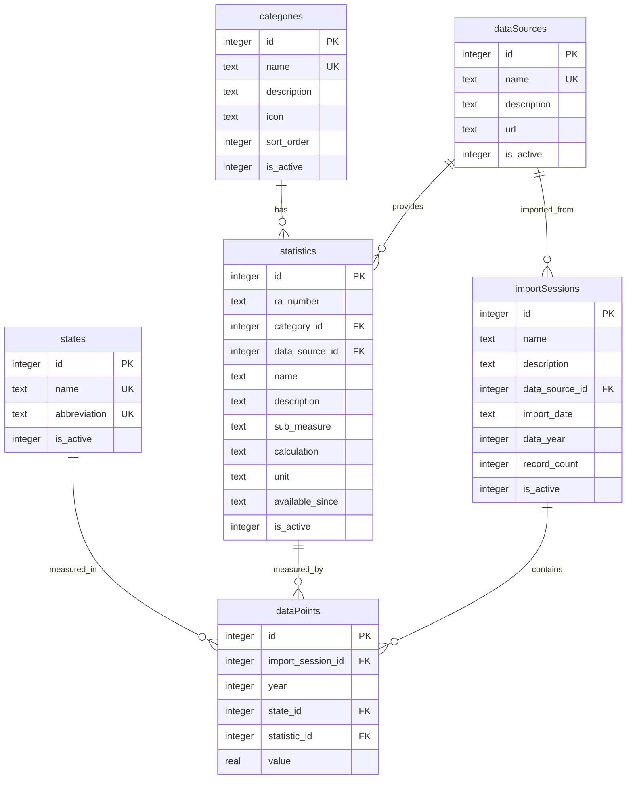
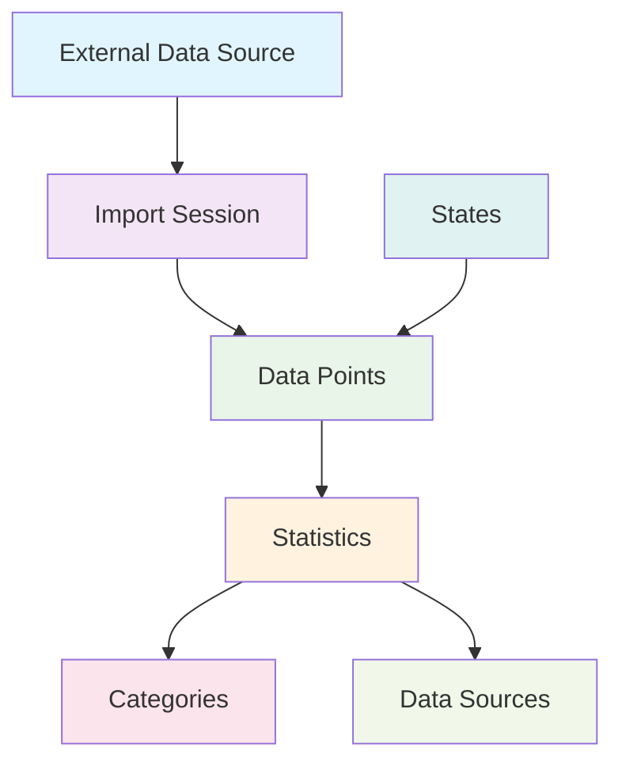

# Results America Database Schema (Normalized)

## Entity Relationship Diagram



## Schema Benefits

### ✅ **Eliminated Denormalizations:**
- **`dataPoints.source`** → Now via `statistics → dataSources`
- **`dataPoints.lastUpdated`** → Now via `importSessions.importDate`

### ✅ **Added Data Integrity:**
- **Source Consistency** - Source changes don't break historical data
- **Import Tracking** - Complete audit trail of data imports
- **Provenance** - Know exactly when/where data came from

### ✅ **Future-Proof for Roadmap:**
- **Phase 2** - Data quality tracking via `importSessions`
- **Phase 3** - Provenance transparency via `dataSources.url`
- **Phase 4+** - All trust-building features supported

## Data Flow



## Sample Queries

### Get Data with Source Information
```sql
SELECT 
    dp.value,
    s.name as statistic_name,
    ds.name as source_name,
    ds.url as source_url,
    is.import_date,
    st.name as state_name
FROM data_points dp
JOIN statistics s ON dp.statistic_id = s.id
JOIN data_sources ds ON s.data_source_id = ds.id
JOIN import_sessions is ON dp.import_session_id = is.id
JOIN states st ON dp.state_id = st.id
WHERE dp.year = 2023;
```

### Get Import History
```sql
SELECT 
    is.name,
    is.import_date,
    is.record_count,
    ds.name as source_name
FROM import_sessions is
JOIN data_sources ds ON is.data_source_id = ds.id
ORDER BY is.import_date DESC;
``` 